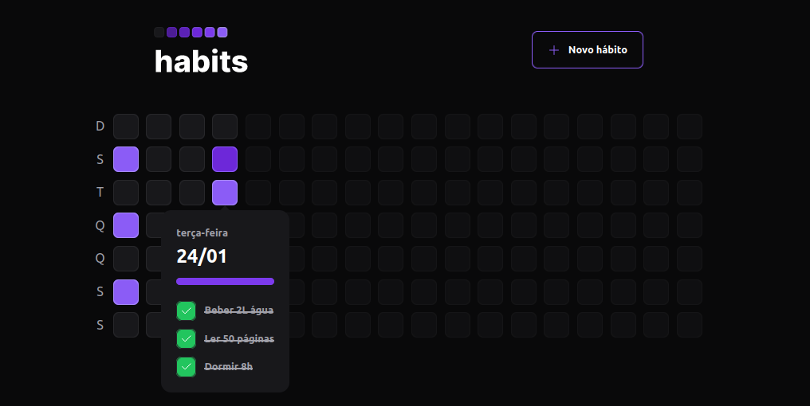

<h1 align="center"> NLW Setup - RocketSeat<h1>

<p align="center">
Desenvolvimento de aplição de ponta a ponta, com front-end, back-end e mobile.
</p>

<br>

<p align="center" style="display:none">
  
</p>

## 🚀 Tecnologias

Esse projeto foi desenvolvido com as seguintes tecnologias:

- [React.js](https://pt-br.reactjs.org/)
- [Node.js](https://nodejs.org/en/)
- [Prisma ORM](https://www.prisma.io/)
- [Fastify](https://www.fastify.io/)
- [Expo](https://expo.dev/)
- [Zod](https://zod.dev/)
- [Vite](https://vitejs.dev/)

## 💻 Projeto

Projeto desenvolvido dentro do NextLevelWeek Setup, promovido pela RocketSeat.

## 🔖 Source

As aulas do NLW Setup podem ser acessadas [ATRAVÉS DESTE LINK](https://app.rocketseat.com.br/event/nlw-setup).

<br /><br/>

<h1> Setup Fron-end</h1>

## 🔥 Front-end

Instale as dependências do projeto:

```
npm install
```

Rode a aplicação:

```
npm run dev
```

ou

```
npm run build
```

## 🔐 Back-end

\*\* Obs: certifique-se de ter o Node.js na versão v18.3.0 LTS instalada.

Instale as dependências

```
npm i
```

Rode o servidor:

```
cd server
npm run dev
```

<br /><br /><br />

<h4 align="center">
 
  <br />
  Feito com ♥ no Ubuntu 22.04 LTS
</h1>
